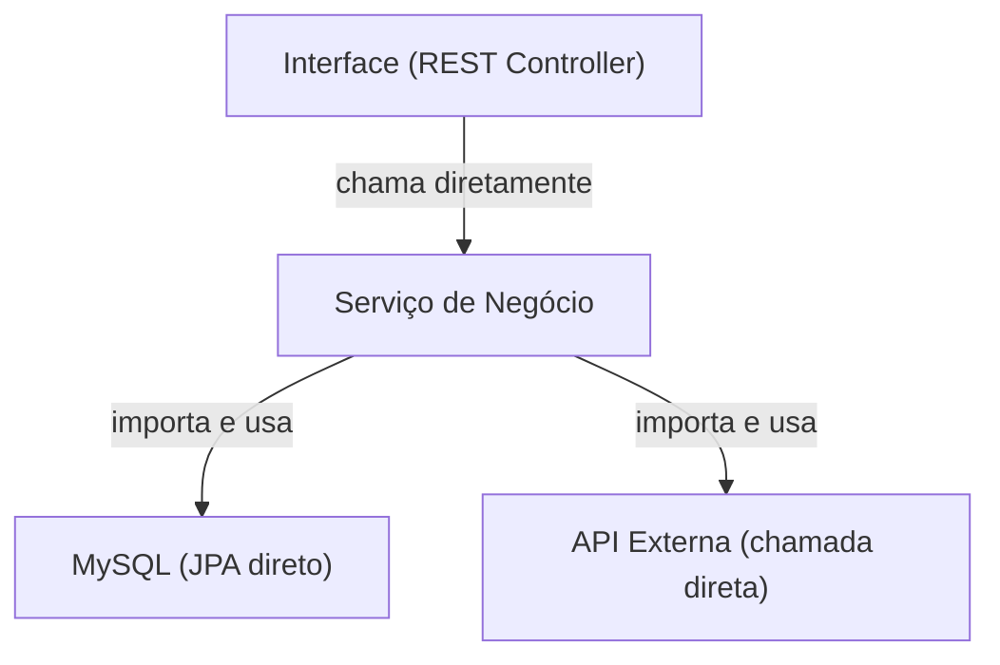

# O Problema

## Analogia: o plug de tomada

Imagine que você comprou uma geladeira nos EUA.
O plug é diferente. Você precisa de um **adaptador**.

Mas e se a geladeira viesse com o fio **soldado na parede**?

> Impossível de mover. Impossível de trocar.

É exatamente o que acontece com software mal estruturado.

---

## Como fica o código "colado"

O `Serviço de Negócio` **conhece** e **depende** de MySQL, da API externa e da interface REST.

---

## O que acontece quando precisamos mudar?

| Mudança | Impacto |
|---|---|
| Trocar MySQL por PostgreSQL | Editar o serviço de negócio |
| Trocar a API externa | Editar o serviço de negócio |
| Criar uma interface CLI além da REST | Duplicar lógica |
| Testar o serviço isolado | Impossível sem subir banco e APIs |

---

## O problema em uma frase

> O código que define **o que o sistema faz**
> não deveria saber **como** ele faz tecnicamente.

Esse é o problema que a Arquitetura Hexagonal resolve.
