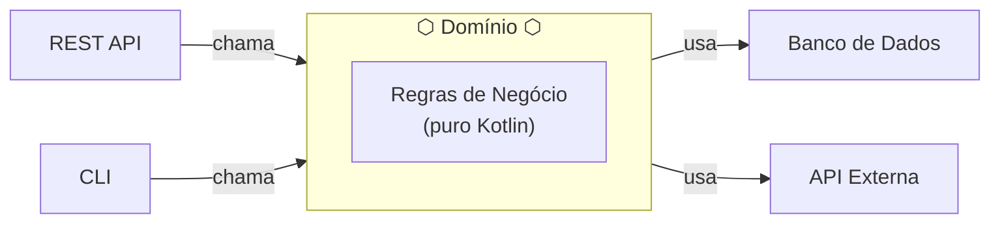

# A Ideia Central

## Uma única regra resolve tudo

> **O domínio não depende de implementações concretas externas.**
> Ele define os **contratos** (interfaces) de que precisa.
> São os detalhes técnicos que se adaptam a esses contratos.

---

## Visualizando o hexágono



O hexágono é o **centro**.
Tudo que está fora é **detalhe técnico**.

---

## Por que hexágono?

Não tem nada de especial no número de lados.
O formato visual foi escolhido por Cockburn para mostrar que
há **múltiplas faces** onde o mundo externo pode se conectar.

Poderia se chamar "Arquitetura Octogonal". O nome que pegou foi hexagonal.

---

## A inversão de dependência

Na arquitetura tradicional:

```
Negócio → depende de → Banco (implementação concreta)
```

Na arquitetura hexagonal:

```
Negócio → depende de → interface LetterRepository  (definida no próprio domínio)
                                  ↑
               LetterPersistenceAdapter (banco) implementa essa interface
```

O negócio define o **contrato** (porta/interface).
O banco assina esse contrato implementando o adaptador.
A seta de dependência aponta **para dentro** do domínio, não para fora.

---

## Os três conceitos que veremos a seguir

| Conceito | Em uma frase |
|---|---|
| **Domínio** | O coração — as regras do negócio |
| **Portas** | Os contratos que o domínio expõe |
| **Adaptadores** | Quem implementa esses contratos |
