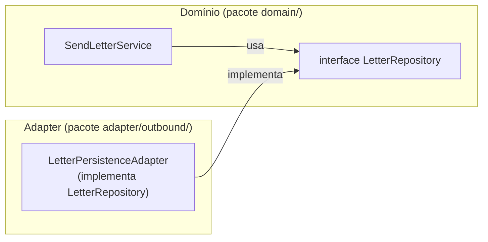

# O Domínio

## O coração da aplicação

O domínio é o código que representa **o que o negócio faz**.
Não como ele persiste dados. Não como ele recebe requisições.
Só as regras.

No nosso projeto:
- Uma carta tem uma mensagem de **no máximo 150 caracteres**
- Uma carta tem um **destinatário** com endereço completo
- Não existe carta sem mensagem e sem endereço

Essas regras ficam aqui. E só aqui.

---

## O domínio sabe que precisa de ajuda — mas não sabe de quem

O domínio precisa salvar cartas. Mas ele não sabe se é MySQL, PostgreSQL ou arquivo de texto.

Para isso ele declara uma **interface** (porta de saída):

```kotlin
// Definida DENTRO do pacote de domínio
interface LetterRepository {
    fun save(letter: Letter): Letter
}
```

E usa essa interface no seu serviço:

```kotlin
class SendLetterService(
    private val repository: LetterRepository,   // interface, não implementação
    private val addressLookup: AddressLookupPort // idem
) : SendLetterUseCase {

    override fun send(message: String, cep: String, numero: String): Letter {
        require(message.length <= 150) { "Mensagem não pode ter mais de 150 caracteres" }
        val address = addressLookup.findByCep(cep, numero)
        val letter = Letter(message = message, address = address)
        return repository.save(letter)
    }
}
```

O domínio **chama** `repository.save()`, mas não sabe o que está do outro lado.

---

## Por que isso importa?



A seta de dependência vai do **adapter para o domínio**, nunca o contrário.
Isso significa: se trocar o banco, só mexe no adapter. O domínio não muda.

---

## Regra de ouro do domínio

> O pacote `domain/` não pode importar nada de fora:
> nada de Spring, nada de JPA, nada de HTTP.
> Só Kotlin puro.

Se você ver `import org.springframework.*` dentro de `domain/`, algo está errado.
