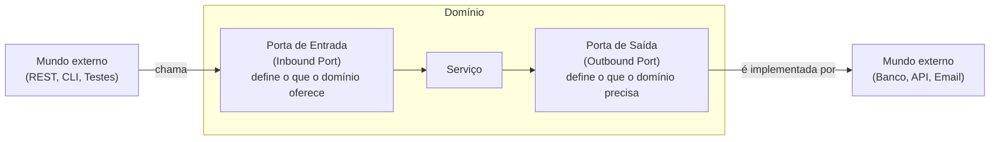

# Portas (Ports)

## O que é uma porta?

Uma porta é uma **interface** — um contrato escrito pelo domínio.

Ela descreve o que o domínio oferece ou o que ele precisa,
sem dizer nada sobre como isso é feito.

---

## Dois tipos de porta



---

## Porta de Entrada (Inbound Port)

Define **o que o domínio oferece** para quem quiser usar.

É uma interface que o domínio **implementa** (via serviço).
O mundo externo a **chama**.

```kotlin
// Porta de entrada — define o caso de uso
interface SendLetterUseCase {
    fun send(message: String, cep: String, numero: String): Letter
}

// O domínio implementa essa porta
class SendLetterService : SendLetterUseCase {
    override fun send(...): Letter { ... }
}
```

Quem chama `SendLetterUseCase` não sabe se está falando com REST, CLI ou um teste.

---

## Porta de Saída (Outbound Port)

Define **o que o domínio precisa** do mundo externo.

É uma interface que o domínio **chama**.
O mundo externo (adapter) a **implementa**.

```kotlin
// Porta de saída — o domínio precisa buscar endereços
interface AddressLookupPort {
    fun findByCep(cep: String, numero: String): Address
}

// Porta de saída — o domínio precisa salvar cartas
interface LetterRepository {
    fun save(letter: Letter): Letter
}
```

O domínio não sabe se o endereço vem do ViaCEP, de um mock ou de um arquivo CSV.

---

## Resumo visual

| | Porta de Entrada | Porta de Saída |
|---|---|---|
| **Quem define** | Domínio | Domínio |
| **Quem implementa** | Domínio (serviço) | Adapter externo |
| **Quem chama** | Adapter externo (REST, CLI) | Domínio (serviço) |
| **Exemplo no projeto** | `SendLetterUseCase` | `LetterRepository`, `AddressLookupPort` |

> Em ambos os casos, as interfaces ficam **dentro do pacote `domain/`**.
> É o domínio que define as regras do jogo.
