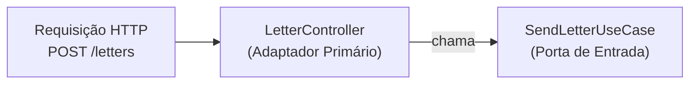
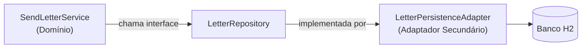
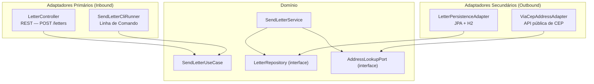

# Adaptadores (Adapters)

## O que é um adaptador?

Um adaptador é a **ponte entre o mundo externo e uma porta**.

É ele que sabe como fazer de verdade:
conectar no banco, chamar a API, ler o terminal, responder HTTP.

O domínio nunca vê os adaptadores diretamente — só vê as interfaces.

> A relação com a porta **não é a mesma** nos dois lados:
> - **Adapter inbound**: *chama* a porta de entrada (quem implementa é o serviço do domínio)
> - **Adapter outbound**: *implementa* a porta de saída (quem chama é o serviço do domínio)

---

## Dois tipos de adaptador

### Adaptador Primário (Inbound / Driving)

Ele **aciona** o domínio. É o ponto de entrada da requisição.



```kotlin
@RestController
class LetterController(
    private val sendLetter: SendLetterUseCase  // chama a porta, nunca o serviço diretamente
) {
    @PostMapping("/letters")
    fun send(@RequestBody request: SendLetterRequest): Letter =
        sendLetter.send(request.message, request.cep, request.numero)
}
```

O controller não implementa a porta — ele a **chama**.
Quem implementa `SendLetterUseCase` é o `SendLetterService` (dentro do domínio).
O controller só traduz HTTP → domínio.

---

### Adaptador Secundário (Outbound / Driven)

Ele **é acionado** pelo domínio. Implementa uma porta de saída.



```kotlin
@Component
class LetterPersistenceAdapter(
    private val jpaRepository: LetterJpaRepository
) : LetterRepository {                          // implementa a porta do domínio

    override fun save(letter: Letter): Letter {
        val entity = letter.toEntity()
        return jpaRepository.save(entity).toDomain()
    }
}
```

---

## Os adaptadores do nosso projeto



---

## A beleza do design

O `SendLetterService` não muda se:
- A entrada muda de REST para CLI (novo adaptador primário)
- O banco muda de H2 para PostgreSQL (novo adaptador secundário)
- A API de CEP muda de ViaCEP para outra (novo adaptador secundário)

**Domínio imutável. Adapters substituíveis.**
