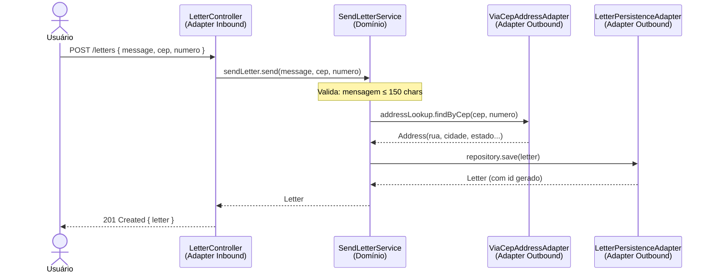
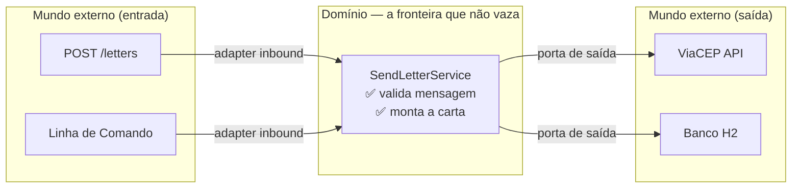

# Fluxo Completo

## O pedido de carta, passo a passo

---

## O que o domínio sabe nesse fluxo?

| Etapa | O domínio sabe? |
|---|---|
| Que a entrada veio de HTTP | ❌ Não — poderia ser CLI |
| Que o endereço veio do ViaCEP | ❌ Não — só chama `AddressLookupPort` |
| Que o banco é H2 | ❌ Não — só chama `LetterRepository` |
| Que a mensagem não pode ter mais de 150 chars | ✅ Sim — é regra de negócio |
| Que precisa de um endereço para criar a carta | ✅ Sim — é regra de negócio |

---

## A fronteira do domínio

O domínio recebe qualquer entrada e delega qualquer saída —
mas a lógica de negócio fica sempre dentro da fronteira.
