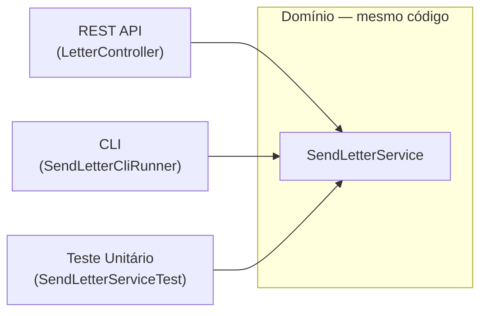

# Por que usar Arquitetura Hexagonal?

## Benefício 1: Testar o domínio sem infraestrutura

Na arquitetura tradicional, testar o serviço exige subir banco, configurar JPA, mockar HTTP.

Na arquitetura hexagonal, basta passar mocks das interfaces:

```kotlin
class SendLetterServiceTest {

    private val fakeRepository = FakeLetterRepository()       // lista em memória
    private val fakeAddressLookup = FakeAddressLookupPort()   // endereço fixo

    private val service = SendLetterService(fakeRepository, fakeAddressLookup)

    @Test
    fun `deve rejeitar mensagem com mais de 150 caracteres`() {
        val mensagemLonga = "x".repeat(151)
        assertThrows<IllegalArgumentException> {
            service.send(mensagemLonga, "01310100", "1000")
        }
    }

    @Test
    fun `deve salvar carta com endereço buscado`() {
        val carta = service.send("Olá!", "01310100", "1000")
        assertNotNull(carta.id)
        assertEquals("Olá!", carta.message)
    }
}
```

Sem banco. Sem HTTP. Sem Spring. Roda em milissegundos.

---

## Benefício 2: Trocar a tecnologia sem mexer no domínio

| O que muda | O que precisa ser alterado |
|---|---|
| MySQL → PostgreSQL | Só o `LetterPersistenceAdapter` |
| ViaCEP → API dos Correios | Só o `ViaCepAddressAdapter` |
| REST → GraphQL | Só o adapter inbound |
| H2 → Redis | Só o `LetterPersistenceAdapter` |
| **Regra dos 150 chars** | **Só o `SendLetterService`** |

Cada mudança fica isolada no seu adapter. O domínio não sente.

---

## Benefício 3: Múltiplas entradas para o mesmo domínio



O mesmo `SendLetterService` é acionado por REST, por linha de comando e por testes.
Sem duplicação de lógica.

---

## Benefício 4: O código documenta a arquitetura

A estrutura de pastas conta a história:

```
domain/port/inbound/   ← o que o sistema oferece
domain/port/outbound/  ← o que o sistema precisa
adapter/inbound/       ← quem aciona o sistema
adapter/outbound/      ← quem o sistema aciona
```

Um desenvolvedor novo entende onde cada coisa vive sem precisar perguntar.

---

## Em resumo

> A Arquitetura Hexagonal é sobre **clareza de responsabilidades** e **liberdade de trocar peças**
> sem medo de quebrar o que já funciona.
