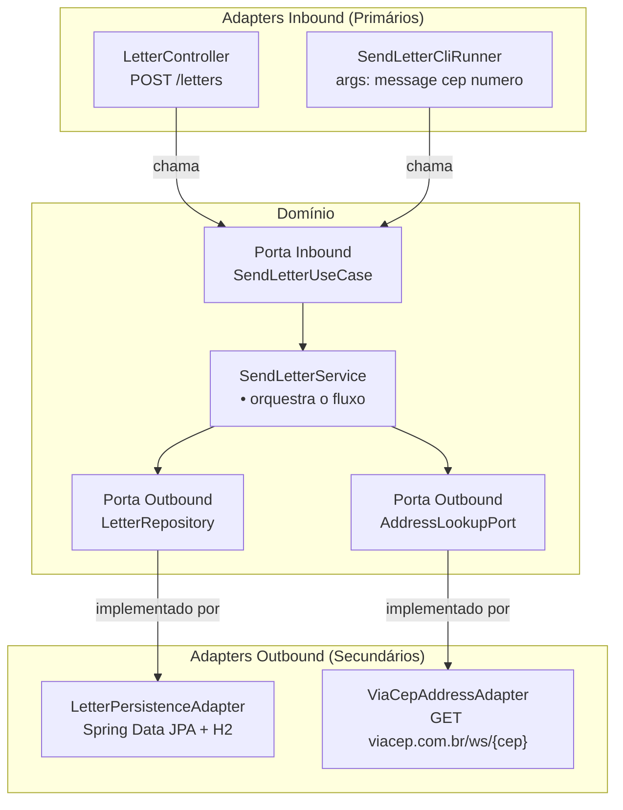

# Nosso Projeto: App de Cartas

## O que o sistema faz

> Alguém envia uma mensagem (até 150 caracteres) com um CEP e número.
> O sistema busca o endereço, cria uma carta e a salva.

---

## Mapeando nos conceitos do hexágono



---

## As entidades do domínio

```kotlin
data class Address(
    val logradouro: String,
    val numero: String,
    val bairro: String,
    val cidade: String,
    val estado: String
)

data class Letter(
    val id: Long? = null,
    val message: String,
    val address: Address
) {
    init {
        require(message.isNotBlank()) { "Mensagem não pode ser vazia" }
        require(message.length <= 150) { "Mensagem não pode ter mais de 150 caracteres" }
    }
}
```

Sem anotações de banco. Sem anotações de JSON. Kotlin puro.
As regras de negócio vivem na entidade — é impossível criar uma `Letter` inválida.

---

## As portas do domínio

```kotlin
// Inbound — o que o sistema oferece
interface SendLetterUseCase {
    fun send(message: String, cep: String, numero: String): Letter
}

// Outbound — o que o sistema precisa
interface AddressLookupPort {
    fun findByCep(cep: String, numero: String): Address
}

interface LetterRepository {
    fun save(letter: Letter): Letter
}
```

---

## Regras que vivem só no domínio

| Regra | Onde fica |
|---|---|
| Mensagem ≤ 150 caracteres | Entidade `Letter` (init) |
| Carta precisa de endereço completo | Entidade `Letter` (init) |
| `Letter` tem `message` e `address` | Entidade `Letter` |

Nenhuma dessas regras está no controller, no adapter ou no banco.
