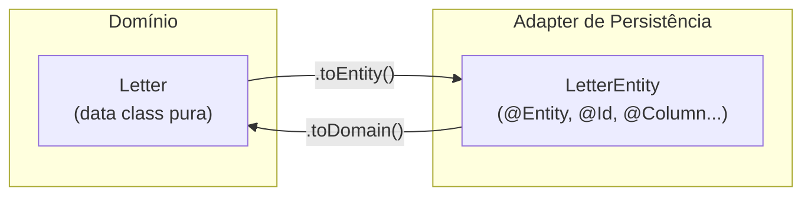
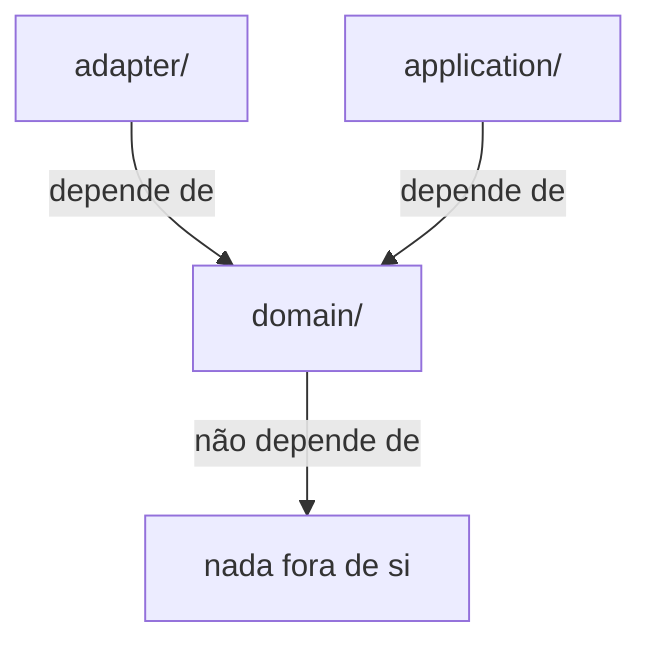

# Estrutura do Projeto

## Árvore de pacotes

```
letter-app/
└── src/main/kotlin/com/hexagonal/letterapp/
    │
    ├── domain/                          ← Kotlin puro. Zero imports externos.
    │   ├── model/
    │   │   ├── Letter.kt                  entidade de negócio
    │   │   └── Address.kt                 entidade de negócio
    │   └── port/
    │       ├── inbound/
    │       │   └── SendLetterUseCase.kt   interface — o que o sistema oferece
    │       └── outbound/
    │           ├── LetterRepository.kt    interface — preciso salvar cartas
    │           └── AddressLookupPort.kt   interface — preciso buscar endereço
    │
    ├── application/                     ← Orquestra o domínio. Pode usar Spring.
    │   └── service/
    │       └── SendLetterService.kt       implementa SendLetterUseCase
    │
    └── adapter/                         ← Detalhes técnicos. Cada um no seu canto.
        ├── inbound/
        │   ├── http/
        │   │   ├── LetterController.kt    chama SendLetterUseCase via REST
        │   │   └── SendLetterRequest.kt   DTO do request HTTP
        │   └── cli/
        │       └── SendLetterCliRunner.kt chama SendLetterUseCase via linha de comando
        └── outbound/
            ├── viacep/
            │   └── ViaCepAddressAdapter.kt  implementa AddressLookupPort
            └── persistence/
                ├── LetterEntity.kt          entidade JPA (não é a do domínio!)
                ├── LetterJpaRepository.kt   interface Spring Data
                └── LetterPersistenceAdapter.kt  implementa LetterRepository
```

---

## Por que `LetterEntity` é separada de `Letter`?



`Letter` não pode ter `@Entity` — isso seria uma dependência de JPA dentro do domínio.
`LetterEntity` é a representação técnica para o banco. São dois objetos com papéis diferentes.

---

## A regra de dependência visualizada



> Se você consegue deletar o pacote `adapter/` e o projeto Kotlin ainda compila,
> sua arquitetura está correta.

---

## Próximo passo

Vamos construir esse projeto arquivo por arquivo,
começando pelo `build.gradle.kts` e seguindo pela ordem das camadas:

**Domínio → Aplicação → Adapters**
