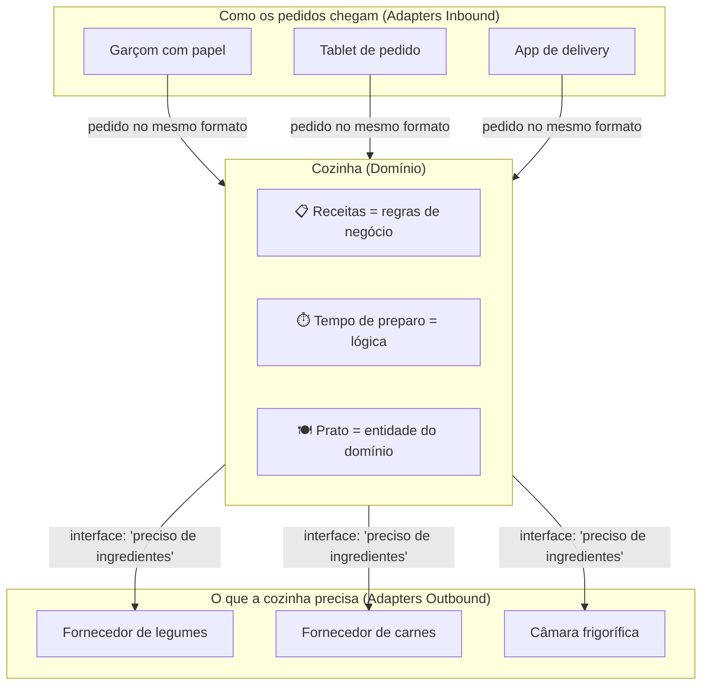

# Analogia: A Cozinha do Restaurante

## O restaurante no dia a dia

Você já foi a um restaurante onde o garçom anota seu pedido,
leva para a cozinha, e depois traz a comida pronta?

Esse fluxo já é arquitetura hexagonal.

---

## O mapa do restaurante

---

## As perguntas que a cozinha NÃO faz

| Pergunta | Quem responde |
|---|---|
| O pedido veio do garçom ou do app? | Adapter inbound |
| O legume veio do fornecedor A ou B? | Adapter outbound |
| A comida vai para mesa ou motoboy? | Adapter inbound de saída |

A cozinha só sabe cozinhar. **O resto é adaptador.**

---

## Traduzindo para o nosso projeto

| Restaurante | App de Cartas |
|---|---|
| Cozinha | `SendLetterService` |
| Receita dos pratos | Regra dos 150 chars |
| Garçom (entrada) | `LetterController` (REST) |
| App de delivery (entrada) | `SendLetterCliRunner` (CLI) |
| Fornecedor de ingredientes | `ViaCepAddressAdapter` |
| Câmara frigorífica | `LetterPersistenceAdapter` (banco) |
| "Preciso de ingredientes" | `AddressLookupPort` (interface) |
| "Preciso guardar o prato" | `LetterRepository` (interface) |

---

## A regra que une tudo

> A cozinha não muda se você trocar o garçom por um robô.
> A cozinha não muda se você trocar o fornecedor de legumes.
>
> O `SendLetterService` não muda se você trocar REST por CLI.
> O `SendLetterService` não muda se você trocar ViaCEP por outra API.

**Isole o que muda. Proteja o que importa.**
